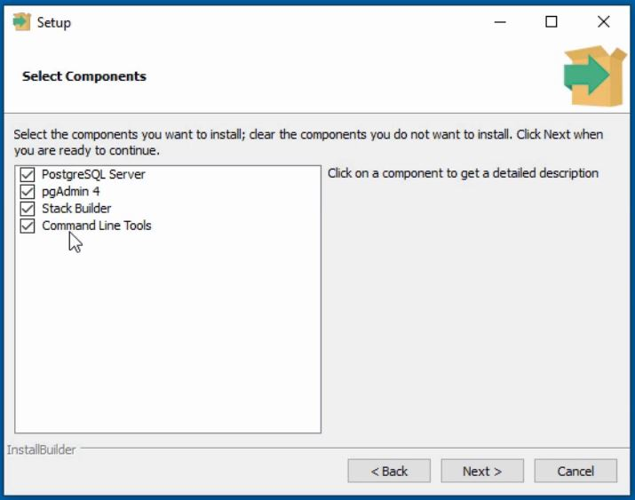
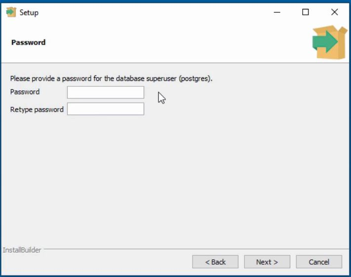
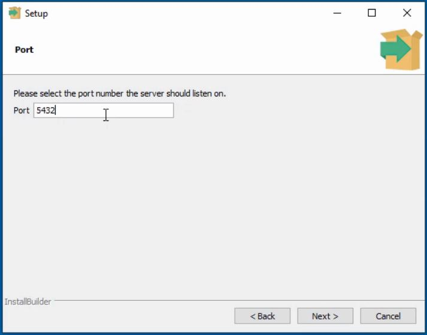

# Installation PostgreSQL

## Download PostgreSQL

Download dilaman resminya : [Klik Disini](https://www.postgresql.org/download/)

## Install PostgreSQL Components

Pada kesempatan kali ini kita tidak membutuhkan **Stack Builder**.

## Setup Password

Berikan ***password*** agar kita bisa mengamankan sistem :

## Setup Port

Tentukan ***port*** yang akan digunakan untuk ***PostgreSQL, port default*** : 5432

